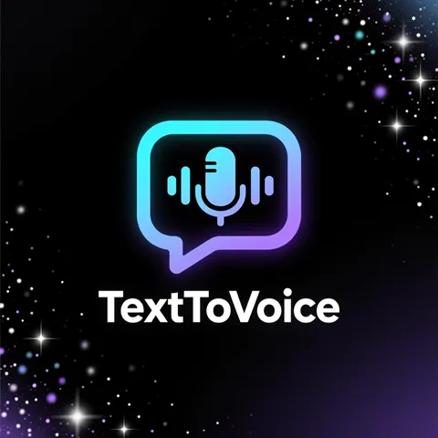
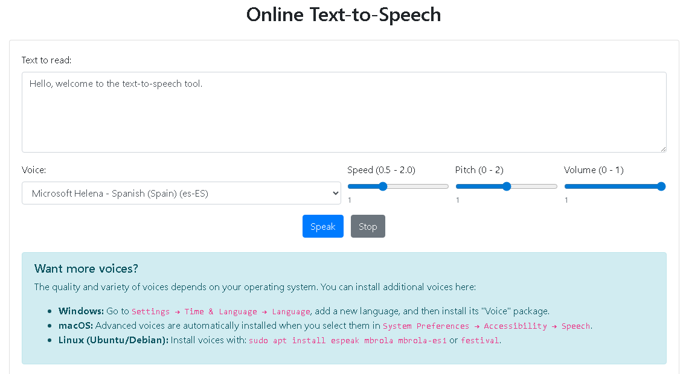

# Text-to-Speech Web Tool

## 🌐 Try It Live

👉 [**Use the tool now**](https://online-tools.muisca.co/en/tools/generators/text-to-voice) – no download needed!

A lightweight, privacy-focused **Text-to-Speech (TTS) web tool** that runs entirely in the browser—no server, no registration, no cost. Built with vanilla HTML, CSS, and JavaScript using Bootstrap 4.4.1.

Perfect for students, developers, content creators, and anyone who needs to hear text spoken aloud—fast and free.

*Main interface with text input, voice selector, and real-time controls*

*Fully responsive on phones and tablets*

---

## ✨ Features

- **100% free** – no hidden fees, no trials, no upsells  
- **No login or registration** – use instantly  
- **Unlimited usage** – speak as much as you want  
- **Privacy-first** – your text never leaves your device  
- **Multiple voices** – uses all system-installed voices (Windows, macOS, Linux, Android)  
- **Real-time controls** – adjust **rate**, **volume**, and **pitch** while speaking  
- **Lightweight** – under 10 KB of JavaScript, no external dependencies  
- **Offline capable** – works without internet once loaded  

---

## 🛠️ Built With

- **HTML5** + **Vanilla JavaScript**  
- **Bootstrap 4.4.1** (CSS only – no jQuery or Bootstrap JS required)  
- **Web Speech API** (native browser TTS)  
- Responsive, accessible, and cross-browser compatible

---

## 🌐 Try It Live

👉 [**Use the tool now**](https://online-tools.muisca.co/en/tools/generators/text-to-voice) – no download needed!

---

## 📦 How to Deploy

1. Clone or download this repository  
2. Upload `index.html` and assets to any static web host (GitHub Pages, Netlify, Vercel, or your own server)  
3. That’s it! No backend, no database, no build step.

> 💡 **Note**: This tool relies on the browser’s built-in `SpeechSynthesis` API. Voice availability and quality depend on the user’s operating system.

---

## 📝 License

MIT License – free to use, modify, and distribute, even commercially.

---

## 🔍 SEO & Accessibility

- Semantic HTML  
- ARIA labels for screen readers  
- Mobile-friendly design  
- Optimized for search engines (clear headings, keyword-rich content)

---

> Made with ❤️ for developers, educators, and privacy-conscious users.  
> **No tracking. No cookies. No nonsense.**
